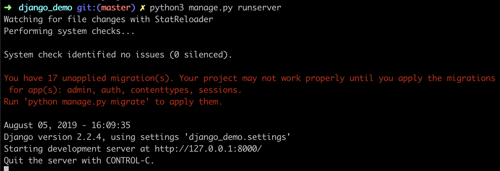
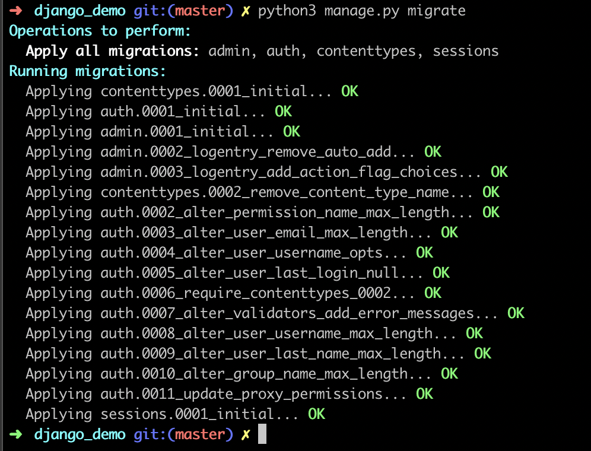

# django_demo
Instructions for children

### 初始化 django 项目

```
# 创建项目
django-admin startproject django_demo

# 启动项目（默认启动的是8000端口，可以修改为8080端口）
cd django_demo
python3 manage.py runserver 8080
```

启动项目后报错如下




```
# 按照迁移命令进行迁移
python3 manage.py migrate
```



迁移成功后重启便可。


### docker 启动 posrgres

```
# 查看postgres镜像
docker search postgres

# 拉取postgres镜像
docker pull postgres

# 查看所有镜像列表
docker images

# 查看所有镜像列表
docker rmi [镜像id | 镜像name]

# 启动镜像为一个容器
docker run --name my_postgres -d -v /Users/chenshijie342/Documents/PostgresData:/var/lib/postgresql/data -p 54320:5432 -e POSTGRES_PASSWORD=111 postgres:latest

# 进入到容器的控制台 （容器内的命令一般在 /bin 或者 /usr/bin）
docker exec -it my_postgres bash

# 也可以直接连接数据库
docker exec -it my_postgres psql -U postgres

# 查看所有容器
docker ps

# 停止容器运行 （停止容器之后 docker ps看不到）
docker stop [容器id | 容器name]

# 删除容器
docker rm [容器id | 容器name]
```

### 控制台登录 postgres
```
# 以 postgres 用户名登录到 postgres
psql -U postgres

# 连接远程的postgres
psql -U postgres -p 54321 -h 192.168.100.172
```

### postgres 常用控制台命令
```
\h：查看SQL命令的解释，比如\h select。
\?：查看psql命令列表。
\l：列出所有数据库。
\c [database_name]：连接其他数据库。
\d：列出当前数据库的所有表格。
\d [table_name]：列出某一张表格的结构。
\du：列出所有用户。
\e：打开文本编辑器。
\conninfo：列出当前数据库和连接的信息。
```

### postgres 常用sql命令
```
# 创建新表 
create table user_tbl(name varchar(20), signup_date date);

# 插入数据 
insert into user_tbl(name, signup_date) values('张三', '2013-12-22');

# 选择记录 
select * from user_tbl;

# 更新数据 
update user_tbl set name = '李四' where name = '张三';

# 删除记录 
delete from user_tbl where name = '李四' ;

# 添加栏位 
alter table user_tbl ADD email varchar(40);

# 更新结构 
alter table user_tbl alter column signup_date SET NOT NULL;

# 更名栏位 
alter table user_tbl rename column signup_date TO signup;

# 删除栏位 
alter table user_tbl drop column email;

# 表格更名 
alter table user_tbl rename to backup_tbl;

# 删除表格 
drop table if exists backup_tbl;
```


